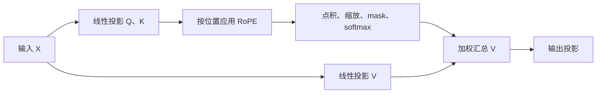

# 3.3 RoPE

RoPE（Rotary Position Embedding，旋转位置编码）通过按位置旋转 Query 和 Key，让注意力分数显式包含两个 token 的相对位置。它由 RoFormer 论文提出。[^roformer]

## 1. 为什么需要位置编码

只看内容投影得到的 $q_m$ 和 $k_n$，点积 $q_m^\top k_n$ 没有显式的位置变量。对于不带位置相关 mask 的自注意力，交换输入 token 的顺序，输出也只是相应交换，模型无法据此区分词序。

例如，“我喜欢你”和“你喜欢我”包含相同的词，但顺序改变了含义。位置编码就是要把这种顺序信息带入计算。因果 mask 能约束“只能看过去”，但它与显式编码相隔几个位置是不同的机制。

常见的绝对位置编码将位置向量加到输入上；RoPE 则在完成线性投影后，对 $Q,K$ 做旋转。下面先解释旋转，再说明为什么它能产生相对位置关系。

## 2. 从二维旋转到高维向量

### 2.1 符号与维度

| 符号 | 含义 |
| --- | --- |
| $m,n$ | token 的位置编号，本文从 0 开始 |
| $d$ | 参与旋转的向量维度，要求为偶数；全维 RoPE 中通常是单个注意力头的维度 |
| $i$ | 二维分组编号，$i = 0,\ldots,d/2-1$ |
| $\theta_i$ | 第 $i$ 组每前进一个位置增加的旋转角度，即角频率 |
| $R_m$ | 位置 $m$ 对应的高维旋转矩阵 |

将一个 $d$ 维向量按相邻维度分成 $d/2$ 组：$(x_0,x_1)$、$(x_2,x_3)$，依此类推。每组可以看作二维平面上的一个向量；位置决定转多少角度，分组决定旋转速度。

### 2.2 每两个维度旋转一次

对第 $m$ 个位置、某一对维度 $(2i,\,2i+1)$，RoPE 做二维旋转：

```math
\begin{pmatrix}
x'_{2i}\\
x'_{2i+1}
\end{pmatrix}
=
\begin{pmatrix}
\cos(m\theta_i) & -\sin(m\theta_i)\\
\sin(m\theta_i) & \cos(m\theta_i)
\end{pmatrix}
\begin{pmatrix}
x_{2i}\\
x_{2i+1}
\end{pmatrix}
```

其中，基础 RoPE 的频率设置为：[^roformer]

```math
\theta_i = 10000^{-2i/d}
```

这里的 `10000` 是频率基数 `base`，并不是最大序列长度。一般可写为 $\theta_i = \mathrm{base}^{-2i/d}$；使用已有模型时，应保持与其训练配置一致。

展开就是：

```math
\begin{aligned}
x'_{2i} &= x_{2i}\cos(m\theta_i)-x_{2i+1}\sin(m\theta_i)\\
x'_{2i+1} &= x_{2i}\sin(m\theta_i)+x_{2i+1}\cos(m\theta_i)
\end{aligned}
```

旋转只改变方向，不改变这一对坐标的长度。因此，拼接所有二维旋转后，整个向量的范数也保持不变：$\|R_m x\|_2 = \|x\|_2$。在位置 $m=0$，旋转角度为 0，输出就是输入本身。

### 2.3 为什么使用不同频率

以 $d=8$、`base = 10000` 为例，四组频率分别为：

```math
(\theta_0,\theta_1,\theta_2,\theta_3) = (1,\;0.1,\;0.01,\;0.001)
```

在位置 $m=3$，四组旋转角度就是 $(3,0.3,0.03,0.003)$ 弧度。高频组随位置变化得快，低频组变化得慢，从而提供不同尺度的位置变化信号。每组的旋转周期为 $2\pi/\theta_i$。

例如，对第一组向量 $(1,0)$，位置 0 的结果为 $(1,0)$，位置 1 的结果约为 $(0.5403,0.8415)$。这里使用的是弧度，不是角度制。

## 3. 为什么能编码相对位置

设 $q_m,k_n$ 是尚未施加 RoPE 的内容向量，旋转后分别为 $\widetilde q_m=R_mq_m$、$\widetilde k_n=R_nk_n$。关键性质是：[^roformer]

```math
\langle R_m q,\; R_n k\rangle
=
\langle q,\; R_{n-m} k\rangle
```

这不是额外规定出来的性质，而是旋转矩阵的乘法规律。二维旋转满足 $R(\alpha)^\top=R(-\alpha)$，且 $R(\alpha)R(\beta)=R(\alpha+\beta)$。对每一组维度分别应用，就得到：

```math
\begin{aligned}
\widetilde q_m^\top\widetilde k_n
&= (R_mq_m)^\top(R_nk_n) \\
&= q_m^\top R_m^\top R_n k_n \\
&= q_m^\top R_{n-m}k_n
\end{aligned}
```

因此，**显式的位置项**只依赖距离 $n-m$。注意力分数仍然取决于内容向量 $q_m,k_n$，并不是说“距离相同，分数就相同”。

把一组二维坐标记为 $q=(a,b)$、$k=(c,e)$，再令 $\Delta=(n-m)\theta_i$，可以直接展开验证：

```math
(R_mq)^\top(R_nk)
= (ac+be)\cos\Delta + (bc-ae)\sin\Delta
```

由此还可以看出两个性质：

- 当 $m=n$ 时，旋转前后的点积相同，因为二者转过相同角度。
- 固定内容向量，将两个位置同时平移 $c$，位置项不变，因为 $(n+c)-(m+c)=n-m$。这不代表改变上下文后整个模型的输出也必然不变。

也可以用复数理解：令 $z=x_{2i}+\mathrm{i}x_{2i+1}$，则旋转等价于 $z'=z\exp(\mathrm{i}m\theta_i)$，其中 $\mathrm{i}$ 是虚数单位。复数乘法与上面的两个实数公式完全等价。

## 4. PyTorch 基础实现

下面与同目录 [3-3-RoPE.py](./3-3-RoPE.py) 一样，使用**相邻维度配对**。输入、输出都是 `(batch_size, seq_len, hidden_dim)`，适合先理解单头、完整序列的计算。这里的 `hidden_dim` 就是公式中的 $d$，不是默认指整个多头模型的隐藏维度。

```python
import logging

import torch
import torch.nn as nn

logger = logging.getLogger(__name__)

class RoPE(nn.Module):
    def __init__(self, hidden_dim, base = 10000):
        super().__init__()
        assert hidden_dim % 2 == 0
        self.hidden_dim = hidden_dim
        self.base = base

    def forward(self, x):
        """
        (x: batch_size, seq_len, hidden_dim)
        """
        _, seq_len, _ = x.shape
        device = x.device

        # Generate frequency, freq: (hidden_dim / 2,)
        dim = torch.arange(0, self.hidden_dim, 2, device = device)  # dim: (hidden_dim / 2,)
        freq = self.base ** (-dim / self.hidden_dim)

        # Generate rotation angle, theta: (seq_len, hidden_dim / 2)
        pos = torch.arange(seq_len, device = device)  # pos: (seq_len,)
        # theta = pos[:, None] * freq[None, :]
        theta = torch.outer(pos, freq)
        logger.info(f"theta shape: {theta.shape}, theta: {theta}")

        # Calculate sine and cosine values, cos/sin: (seq_len, hidden_dim / 2)
        cos = torch.cos(theta)
        sin = torch.sin(theta)
        logger.info(f"cos shape: {cos.shape}, cos: {cos}")
        logger.info(f"sin shape: {sin.shape}, sin: {sin}")

        # x split into odd and even dimensions, x_odd/x_even: (batch_size, seq_len, hidden_dim / 2)
        x_even = x[..., 0::2]
        x_odd = x[..., 1::2]
        logger.info(f"x_even shape: {x_even.shape}, x_even: {x_even}")
        logger.info(f"x_odd shape: {x_odd.shape}, x_odd: {x_odd}")

        # Calculate odd and even RoPE, out_odd, out_even: (batch_size, seq_len, hidden_dim / 2)
        out_even = cos * x_even - sin * x_odd
        out_odd = sin * x_even + cos * x_odd

        output = torch.zeros_like(x)
        output[..., 0::2] = out_even
        output[..., 1::2] = out_odd
        return output

if __name__ == "__main__":
    logging.basicConfig(
        level = logging.INFO,
        format = '%(asctime)s - %(name)s - %(levelname)s - %(message)s',
        handlers = [logging.StreamHandler()]
    )

    # 测试RoPE
    batch_size = 2
    seq_len = 4
    hidden_dim = 8
    x = torch.randn(batch_size, seq_len, hidden_dim)
    rope = RoPE(hidden_dim)
    output = rope(x)
    logger.info(f"Input shape: {x.shape}, Output shape: {output.shape}")
    logger.info(f"Input: {x}")
    logger.info(f"Output: {output}")
```

### 4.1 代码中的张量形状

记 batch 大小为 $B$，序列长度为 $L$：

| 变量 | 形状 | 对应操作 |
| --- | --- | --- |
| `dim`、`freq` | `(d / 2,)` | 生成各二维分组的角频率 |
| `pos` | `(L,)` | 生成位置 `0` 到 `L - 1` |
| `theta`、`cos`、`sin` | `(L, d / 2)` | 外积得到所有位置、所有分组的角度及三角函数值 |
| `x_even`、`x_odd` | `(B, L, d / 2)` | 按从 0 开始的偶数、奇数下标拆分坐标 |
| `out_even`、`out_odd` | `(B, L, d / 2)` | 通过广播，在 batch 内使用同一组位置角度 |
| `output` | `(B, L, d)` | 将旋转结果交错写回原来的维度顺序 |

注意：公式中的 $\theta_i$ 对应代码的 `freq`；代码中的 `theta` 是乘上位置后的角度 $m\theta_i$。`torch.outer(pos, freq)` 等价于 `pos[:, None] * freq[None, :]`，不是对元素逐个相乘。

### 4.2 设备、精度与广播

- 在未更改默认设备的常规环境中，`torch.arange` 等创建函数默认在 CPU 上创建张量。这里显式使用 `device = x.device`，保证 `pos`、`dim` 与输入在同一设备；`torch.zeros_like(x)` 会继承输入的形状、设备和数据类型。
- `...` 可以省略部分维度，可以出现在开头、中间、结尾，但一个索引表达式里只能有一个。
- `cos`、`sin` 自动沿 batch 维广播，不需要为每个样本复制一份。本例假定 batch 内所有样本使用相同位置编号。
- 工程实现可用 float32 计算频率、角度和三角函数，再将 `cos`、`sin` 转为输入的数据类型，减少低精度大位置计算的误差；本例通过 `zeros_like(x)` 写回，最终输出类型与输入相同。
- 频率和三角函数可以缓存复用，避免每次重新计算。逐元素旋转的计算量为 $O(BLd)$，无需真的构造一个 $d\times d$ 的矩阵。

## 5. 在自注意力中使用 RoPE

通常只对 $Q,K$ 施加 RoPE，让位置信息影响“关注哪个 token”；$V$ 保留作为加权汇总的内容。只旋转 $Q,K$ 已足以得到上面的相对位置点积性质。

```math
\mathrm{Attention}(Q,K,V)
= \mathrm{softmax}\!\left(
\frac{\widetilde Q\widetilde K^\top}{\sqrt{d}}+M
\right)V
```

其中 softmax 沿 Key 的序列维计算；$M$ 是加性 mask，可见位置为 0，被屏蔽的位置为 $-\infty$。RoPE 不会自动屏蔽未来 token，因果 mask 仍需单独提供。



下面是单头示例，需与上一节的 `RoPE` 类一起使用：

```python
import math
import torch
import torch.nn as nn
import torch.nn.functional as F

# 复用上一节的 RoPE 类 / Reuse the RoPE class defined above.

class SelfAttention(nn.Module):
    def __init__(self, d_model):
        super().__init__()
        assert d_model % 2 == 0

        self.d_model = d_model

        self.q_proj = nn.Linear(d_model, d_model, bias = False)
        self.k_proj = nn.Linear(d_model, d_model, bias = False)
        self.v_proj = nn.Linear(d_model, d_model, bias = False)
        self.o_proj = nn.Linear(d_model, d_model, bias = False)

        self.rope = RoPE(d_model)

    def forward(self, x, mask = None):
        """
        x: (batch, seq_len, d_model)
        mask: (seq_len, seq_len), True=屏蔽, broadcast到batch维度
        """
        Q = self.q_proj(x)
        K = self.k_proj(x)
        V = self.v_proj(x)

        # RoPE 只作用在 Q 和 K 上
        Q = self.rope(Q)
        K = self.rope(K)

        scores = torch.matmul(Q, K.transpose(-2, -1)) / math.sqrt(self.d_model)
        if mask is not None:
            scores = scores.masked_fill(mask, float("-inf"))

        attn_weights = F.softmax(scores, dim = -1)
        out = torch.matmul(attn_weights, V)

        return self.o_proj(out)
```

本例中 `mask = None` 表示所有位置互相可见；若用于自回归语言模型，应传入严格上三角为 `True` 的布尔 mask。例如，长度为 3 时：

```text
[[False, True,  True ],
 [False, False, True ],
 [False, False, False]]
```

这里 `True` 表示屏蔽，这是本例 `masked_fill` 的约定。还要确保每个有效 Query 至少能看到一个 Key，否则一整行 $-\infty$ 的 softmax 会产生无效值。

## 6. 多头注意力与增量推理注意事项

### 6.1 多头注意力按 head_dim 旋转

多头注意力通常先将投影结果整理为 `(B, H, L, D)`，其中 $H$ 是头数，$D$ 是 `head_dim`。各头独立进行旋转，基础全维 RoPE 应使用 $d=D$，注意力分数也按 $\sqrt{D}$ 缩放。

对应的 `cos`、`sin` 可整理为 `(1, 1, L, D / 2)`，沿 batch 和 head 维广播。上面的 `forward` 使用 `_, seq_len, _ = x.shape`，只接收三维输入，不能直接传入四维张量；需要调整形状处理，或先合并 batch 与 head 维。部分维度使用 RoPE 时，只有参与旋转的那部分必须为偶数，其余维度原样保留。

### 6.2 KV Cache 必须使用真实位置

基础实现每次从位置 0 开始，适用于完整序列前向。若已有长度为 $T$ 的缓存，新生成一个 token 的位置应为 $T$，而不是因为这次输入长度为 1 就再次使用位置 0。

由 $R_m^\top R_n=R_{n-m}$ 可知，Query 和缓存 Key 必须处于一致的位置坐标系。因此，在使用固定频率的增量推理中：

1. 用当前真实位置旋转新 token 的 $Q,K$。
2. 缓存旋转后的新 $K$ 和对应的 $V$，与历史缓存拼接。
3. 新 $Q$ 与缓存的 $K$ 计算注意力，历史 $K$ 无需再次旋转。

如果扩展此教学实现，可让 `forward` 接收位置偏移或显式 `position_ids`。有 padding 或 batch 内有效长度不一致时，应根据样本构造位置编号，不能只根据当前张量长度生成同一份 `arange`。

### 6.3 维度配对方式必须一致

本例配对方式为 $(0,1),(2,3),\ldots$。另一种写法先把向量分成前后两半，配对 $(0,d/2),(1,d/2+1),\ldots$，旋转辅助向量写作 `[-x_second_half, x_first_half]`。

这两种布局可以通过固定的维度重排对应，但对同一个未重排的向量并不是同一个操作。使用已有权重时，维度配对、频率排列、投影权重的排列必须匹配，不能只替换一个旋转函数。

## 7. 常见理解误区

| 问题 | 说明 |
| --- | --- |
| RoPE 是绝对位置编码还是相对位置编码？ | 操作使用绝对位置 $m,n$，点积中的显式位置关系变成 $n-m$ |
| 旋转保持范数，为什么注意力会改变？ | 不同位置旋转角度不同，两向量之间的夹角会改变；范数相同不代表点积相同 |
| 距离越远，注意力一定越小吗？ | 不一定。二维展开包含振荡的正弦、余弦项，系数还取决于内容，不能理解为每个分数随距离单调下降 |
| 能计算任意位置，就能无限外推吗？ | 不能。公式可计算不等于模型学会了训练范围之外的位置关系，长上下文效果仍需验证 |
| 只调整 `base` 就能无损扩展上下文吗？ | 不能保证。它会改变位置到角度的映射，也改变模型已学到的注意力模式 |
| RoPE 有可训练的位置参数吗？ | 本文基础实现没有；`base` 和频率由公式确定，$Q,K$ 的投影权重仍需训练 |

阅读代码时，可以用三个性质自查：位置 0 的输出等于输入、旋转前后范数一致、固定内容时同时平移 Query 和 Key 的位置不改变点积。浮点实现中应按容差比较，而非要求逐位相等。

## 8. 参考资料

[^roformer]: Su et al. [RoFormer: Enhanced Transformer with Rotary Position Embedding](https://arxiv.org/abs/2104.09864)，第 3 节介绍旋转位置编码及其相对位置性质。
