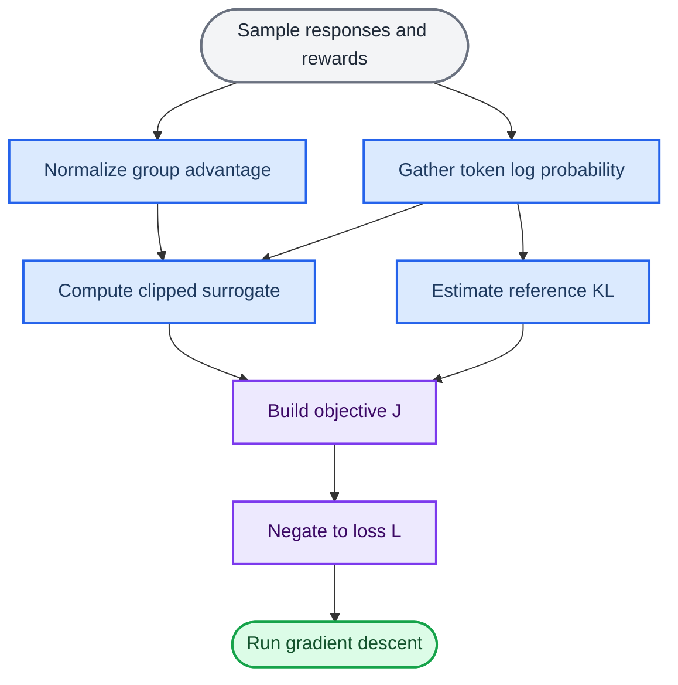
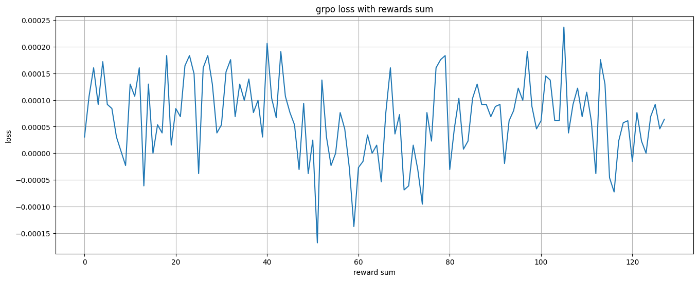

# 从代码拆解 GRPO Loss：各组成项、负值与目标上升

_GRPO loss 最小实现与实验分析 · 2026-06-30_

---

## 摘要

我在拆解 GRPO loss 时，最初的疑问不是公式从哪里来，而是一个更直接的训练现象：为什么 loss 可以小于 0？优化器明明执行 gradient descent，论文却在写 objective ascent；当 reward 上升时，loss 又应该向哪个方向变化？

结论先写在前面。代码返回的是 GRPO objective 的相反数：

$$
\mathcal{L}_{\mathrm{GRPO}}(\theta) = -J_{\mathrm{GRPO}}(\theta)
$$

因此，最小化 loss 等价于最大化 objective。loss 为负只表示当前 batch 上的 policy surrogate 大于 KL penalty，并不表示训练异常。更进一步，loss 的绝对值和正负号都不是策略质量的可靠指标；给 loss 加任意常数不会改变梯度，却可以随意改变它的符号。

本文以一段 GRPO loss 最小实现为主线，并复盘配套实验。多组 loss 接近 0，并非 reward 与 loss 之间存在某种稳定规律，而是因为同一个标量 ratio 被广播给整组标准化 advantage，policy 项在求和时抵消了。

## 问题定义与目标函数

### 分析边界

GRPO 由 DeepSeekMath 工作引入，可以看成不训练 value model 的 PPO 变体：它从同一 prompt 的多条回答中构造组内相对优势，再沿用 PPO-style clipped surrogate 约束策略更新。[^1] PPO 的原始目标是对 surrogate objective 做 stochastic gradient ascent；工程实现通常取负号，再交给执行 gradient descent 的优化器。[^2]

本文分析的是一个面试与学习用途的最小实现，不是完整 trainer。代码保留了以下计算：

- 从当前策略、旧策略与参考策略中取得生成 token 的 log probability
- 用 group advantage 决定提高或降低回答概率
- 用 importance ratio 和 clipping 限制单轮更新
- 用 reference KL penalty 约束策略漂移
- 只对 response token 聚合 loss

reward model、在线采样、多个 prompt 的 group 组织、padding、分布式训练和优化器状态不在该实现中。理解这一边界很重要，否则很容易把 shape demo 的行为当成真实训练曲线。

### 代码对应的目标函数

对 prompt $q$ 采样 $G$ 条回答 $\{o_i\}_{i=1}^{G}$。代码对应的最大化目标可以写成：

$$
J_{\mathrm{GRPO}}(\theta)
=
\frac{1}{G}
\sum_{i=1}^{G}
\frac{1}{|o_i|}
\sum_{t=1}^{|o_i|}
\left[
\min\left(
r_{i,t}(\theta) A_i,
\operatorname{clip}\left(r_{i,t}(\theta), 1-\epsilon, 1+\epsilon\right) A_i
\right)
- \beta K_{i,t}
\right]
$$

其中：

$$
r_{i,t}(\theta)
=
\exp\left(
\log \pi_\theta(o_{i,t}\mid q,o_{i,<t})
-
\log \pi_{\theta_{\mathrm{old}}}(o_{i,t}\mid q,o_{i,<t})
\right)
$$

代码最终返回：

$$
\mathcal{L}_{\mathrm{GRPO}}(\theta)
=
-J_{\mathrm{GRPO}}(\theta)
$$

下面的计算图概括了代码中的数据关系。图中 objective 是要最大化的量，loss 才是优化器接收的量。



## 输入与张量链路

### 从 logits 到 response token 概率

示例构造了三套 shape 为 `(3, 5, 32)` 的 logits：

```python
pi_logits = torch.randn(3, 5, 32)
pi_ref_logits = torch.randn(3, 5, 32)
pi_old_logits = torch.randn(3, 5, 32)
```

三个维度依次表示 batch、sequence 和 vocabulary：

$$
\text{logits}\in\mathbb{R}^{B\times T\times V}
$$

沿词表维执行 `log_softmax` 后，shape 不变。`torch.gather` 再从每个位置的 $V$ 个候选中取出 `token_ids` 对应的 log probability：

```python
pi_logprob = torch.gather(
    pi_logprob,
    dim = -1,
    index = token_ids.unsqueeze(-1)
).squeeze(-1)
```

维度变化是：

$$
(B,T,V)
\xrightarrow{\operatorname{gather}}
(B,T,1)
\xrightarrow{\operatorname{squeeze}}
(B,T)
$$

三套策略在后续计算中的职责不同：

| 张量 | 代码变量 | 用途 |
| --- | --- | --- |
| 当前策略 | `pi_logprob` | 保留梯度，接受参数更新 |
| 旧策略 | `pi_old_logprob` | 构造 importance ratio 的分母 |
| 参考策略 | `pi_ref_logprob` | 构造 KL penalty，限制策略漂移 |

该示例只验证 shape。真实 causal LM 还要处理一位偏移：位置 $t$ 的 logits 通常预测位置 $t+1$ 的 token。如果上游没有提前 shift，直接用同位置 `token_ids` gather 会造成 label 与 logits 错位。标准处理通常是对 `logits[:, :-1]` 和 `token_ids[:, 1:]` 对齐，再重新确定 response mask 的边界。

### Group advantage

实验代码使用组内标准化构造 advantage：

$$
A_i
=
\frac{R_i-\bar{R}}
{\sigma_R+\delta}
$$

它给出了 GRPO 最直接的相对比较：高于组内均值的回答得到正 advantage，低于均值的回答得到负 advantage。主 loss 函数没有计算这一步，而是直接接收：

```python
advantage = torch.tensor([-1, 2, 1])
```

进入 loss 前，代码将 `(B,)` 扩成 `(B, 1)`：

```python
advantage = advantage.unsqueeze(dim = 1)
```

它随后广播到 `(B, T)`，所以同一条回答中的所有 response token 共用一个 sequence-level advantage。

这项设计带来两个不应忽略的性质。

第一，组内标准化后满足：

$$
\sum_{i=1}^{G}A_i\approx 0
$$

第二，给整组 reward 加同一个常数不会改变 advantage；在忽略 $\delta$ 的情况下，把 reward 乘以正数也基本不会改变 advantage。因此，raw reward 整体变大，不会机械地让 GRPO loss 变大或变小。

如果一组回答的 reward 完全相同，所有 advantage 都是 0。此时 group comparison 没有提供策略梯度信号，loss 中只剩 KL penalty。该现象不区分「全部回答都很好」与「全部回答都很差」；二者都缺少组内排序信息。

## Loss 各组成项

### Importance ratio 与 clipping

代码用当前策略和采样时的旧策略构造 ratio：

```python
ratio = torch.exp(pi_logprob - pi_old_logprob)
ratio_clip = torch.clamp(ratio, 1 - epsilon, 1 + epsilon)
```

当 `epsilon = 0.2` 时，裁剪区间是 `[0.8, 1.2]`。ratio 的含义很直接：

$$
r_{i,t}>1
\Rightarrow
\pi_\theta(o_{i,t})>\pi_{\theta_{\mathrm{old}}}(o_{i,t})
$$

当前策略比旧策略更倾向该 token；$r_{i,t}<1$ 则相反。

surrogate 项写成：

```python
policy_gradient = torch.minimum(
    ratio * advantage,
    ratio_clip * advantage
)
```

`minimum` 同时覆盖正负 advantage，但两种符号触发 clipping 的方向不同：

| Advantage | 触发零梯度的区域 | 约束的行为 |
| --- | --- | --- |
| $A_i>0$ | $r_{i,t}>1+\epsilon$ | 不再奖励过度提高好回答的概率 |
| $A_i<0$ | $r_{i,t}<1-\epsilon$ | 不再奖励过度降低差回答的概率 |

在相反方向上，surrogate 不会被截成常数。例如 $A_i>0$ 且 ratio 下降时，目标仍会惩罚该变化；模型不能借 clipping 忽略一个正在被错误压低概率的好回答。

`policy_gradient` 这个变量名容易造成误解。此时张量里存放的是 surrogate objective contribution，并不是真正的梯度；只有调用 `loss.backward()` 后，autograd 才会对模型参数计算 gradient。

### Reference KL penalty

代码中的 KL 项是：

```python
kl = (
    pi_ref_logprob.exp() / pi_logprob.exp()
    - (pi_ref_logprob - pi_logprob)
    - 1
)
```

令：

$$
\Delta_{i,t}
=
\log\pi_{\mathrm{ref}}(o_{i,t})
-
\log\pi_\theta(o_{i,t})
$$

则每个 token 的估计量为：

$$
K_{i,t}
=
e^{\Delta_{i,t}}-\Delta_{i,t}-1
=
\frac{\pi_{\mathrm{ref}}(o_{i,t})}{\pi_\theta(o_{i,t})}
-
\log\frac{\pi_{\mathrm{ref}}(o_{i,t})}{\pi_\theta(o_{i,t})}
-1
$$

由 $e^x\geq 1+x$ 可知：

$$
K_{i,t}\geq 0
$$

当前策略与参考策略在该 token 上概率相等时，$K_{i,t}=0$。该 sampled KL 形式与 DeepSeekMath 中 GRPO objective 的写法一致。[^1] 当 token 确实采样自当前策略时，对它取期望可以恢复 $D_{\mathrm{KL}}(\pi_\theta\|\pi_{\mathrm{ref}})$；如果数据来自旧策略，或像当前示例一样使用硬编码 token，它更准确的称呼是 sample-level KL surrogate，而不是完整词表上的精确 KL。

它的梯度方向也能直接读出。loss 中的 KL 部分是 $+\beta K_{i,t}$，并且：

$$
\frac{\partial K_{i,t}}
{\partial\log\pi_\theta(o_{i,t})}
=
1-
\frac{\pi_{\mathrm{ref}}(o_{i,t})}
{\pi_\theta(o_{i,t})}
$$

当当前策略概率高于 reference 时，该导数为正，gradient descent 会把当前 log probability 往下拉；当前策略概率低于 reference 时，方向相反。KL 在这里是软约束，不要求两套策略完全相同。

### Mask、长度归一化与标量聚合

示例中前三个 token 是 prompt，后两个 token 是 response：

```python
mask = torch.zeros(bs, seq_len)
mask[:, input_len:] = 1
```

当 `input_len = 3` 时：

```text
[
    [0, 0, 0, 1, 1],
    [0, 0, 0, 1, 1],
    [0, 0, 0, 1, 1],
]
```

prompt 是策略生成的条件，不应进入 response policy objective。mask 同时作用于 surrogate 和 KL：

```python
loss = (policy_gradient - beta * kl) * mask
```

下一行完成 batch 平均、回答长度平均和符号翻转：

```python
loss = (-1 / bs) * (1 / len_oi.unsqueeze(dim = 1)) * loss
loss = loss.sum()
```

在当前 `(B, T) = (3, 5)`、response 长度为 2 的例子中，真正参与聚合的是 6 个 token，每个 token 的外部系数是：

$$
-\frac{1}{3}\times\frac{1}{2}
=
-\frac{1}{6}
$$

完整 shape 链路如下：

| 步骤 | 输入 shape | 输出 shape |
| --- | --- | --- |
| `log_softmax` | `(B, T, V)` | `(B, T, V)` |
| `gather` | `(B, T, V)` 与 `(B, T, 1)` | `(B, T, 1)` |
| `squeeze` | `(B, T, 1)` | `(B, T)` |
| advantage 扩维 | `(B,)` | `(B, 1)` |
| ratio、clip、KL | `(B, T)` | `(B, T)` |
| response mask | `(B, T)` | `(B, T)` |
| 长度归一化 | `(B, T)` 与 `(B, 1)` | `(B, T)` |
| 全量求和 | `(B, T)` | scalar |

## Loss 符号与优化方向

### 为什么 loss 可以是负数

将 mask 和平均记号暂时省略，代码返回的 loss 是：

$$
\mathcal{L}
=
-\operatorname{mean}(S-\beta K)
=
\beta\operatorname{mean}(K)
-
\operatorname{mean}(S)
$$

其中 $S$ 是 clipped policy surrogate。于是：

$$
\mathcal{L}<0
\quad\Longleftrightarrow\quad
\operatorname{mean}(S)
>
\beta\operatorname{mean}(K)
$$

这只是两项相减后的结果。cross-entropy 之所以常为正，是因为其定义和概率范围保证了这一点；GRPO loss 没有相同的取值下界约定。

判断符号是否重要，还有一个更干脆的方法。给 loss 加上任意常数 $C$：

$$
\mathcal{L}'(\theta)=\mathcal{L}(\theta)+C
$$

它的梯度完全不变：

$$
\nabla_\theta\mathcal{L}'
=
\nabla_\theta\mathcal{L}
$$

只要 $C$ 足够大，负 loss 可以整体变成正数；只要 $C$ 足够小，正 loss 也可以整体变成负数。优化路径一丝不变。loss 的零点是人为约定，梯度才决定参数更新。

### Gradient descent 为什么等价于 objective ascent

优化器执行：

$$
\theta_{k+1}
=
\theta_k
-
\eta\nabla_\theta\mathcal{L}(\theta_k)
$$

代入 $\mathcal{L}=-J$：

$$
\theta_{k+1}
=
\theta_k
+
\eta\nabla_\theta J(\theta_k)
$$

从 loss 的视角看，这是 gradient descent；从 GRPO objective 的视角看，同一步更新就是 gradient ascent。两种说法没有冲突，只是观察对象不同。

忽略 clipping 和 KL，单个 token 的 policy loss 为：

$$
\mathcal{L}_{i,t}^{\mathrm{policy}}
=
-r_{i,t}A_i
$$

令 $\ell_{i,t}=\log\pi_\theta(o_{i,t})$，则：

$$
\frac{\partial\mathcal{L}_{i,t}^{\mathrm{policy}}}
{\partial\ell_{i,t}}
=
-r_{i,t}A_i
$$

- 当 $A_i>0$ 时，导数为负。gradient descent 会提高该 token 的 log probability
- 当 $A_i<0$ 时，导数为正。gradient descent 会降低该 token 的 log probability
- 当 surrogate 进入 clipping 的常数分支时，policy 项对 ratio 的局部梯度为 0

这里把 token log probability 当成独立变量，只用于说明方向。真实模型中的 logits 通过 softmax 和共享参数耦合，一个 token 的更新也会影响其他 token。

### loss 等于 0 时为什么仍然可以学习

在一次 fresh on-policy update 开始时，当前策略通常等于旧策略，因此 $r_{i,t}=1$。如果 advantage 做过组内中心化：

$$
\frac{1}{G}\sum_i A_i=0
$$

只看 loss 数值，policy objective 可能恰好等于 0。但它的梯度一般不是 0：

$$
\left.
\nabla_\theta J(\theta)
\right|_{\theta=\theta_{\mathrm{old}}}
=
\frac{1}{G}
\sum_i
A_i
\nabla_\theta
\log\pi_\theta(o_i\mid q)
$$

不同回答对应不同的 token、上下文和参数梯度。即使 advantage 的标量和为 0，这些向量也不会通常彼此抵消。

这里需要区分函数值与梯度：函数值为 0，不等于函数在该点的梯度为 0。GRPO 在初始 policy loss 接近 0 时仍然可以产生有效更新。

## 实验现象的重新解释

为隔离变量，实验中的 `minimal_grpo_loss` 去掉了 clipping 和 token 维度：

```python
loss = -(
    torch.exp(pi_logprob - pi_old_logprob) * A
    - beta * KL
)
```

这里的 `pi_logprob`、`pi_old_logprob` 和 `pi_ref_logprob` 都是标量，同一个 ratio 与同一个 KL 被广播到整组 8 个样本。由于标准化 advantage 的和接近 0：

$$
\sum_{i=1}^{G}rA_i
=
r\sum_{i=1}^{G}A_i
\approx 0
$$

policy 项必然抵消，聚合 loss 近似为：

$$
\sum_i\mathcal{L}_i
\approx
G\beta K
$$

这可以逐项解释已有输出：

| 实验设置 | 输出 | 实际原因 |
| --- | ---: | --- |
| `pi = pi_old = 0.5`，`pi_ref = 0.6` | `0.0014` | policy 项抵消，留下 8 份 KL penalty |
| ratio 为 20，一个正 reward | `-3.8147e-06` | 理论上接近 0，负号来自浮点误差 |
| ratio 为 20，两个正 reward | `3.8147e-06` | 理论上接近 0，正号同样来自浮点误差 |
| 正 reward 数从 1 增至 7 | 约等于 `0` | ratio 对所有样本相同，无法打破 advantage 抵消 |
| `pi = pi_old` 从 `0.4` 降到 `0.1` | `0.0000 → 0.1297` | policy 项继续抵消，策略远离 reference 后 KL 增大 |



_图 1：横轴按循环索引绘制，对应 reward sum 从 1 增至 128；纵轴是聚合 loss。曲线围绕约 $6\times10^{-5}$ 的 KL 基线波动，主要变化来自 float32 下的大数抵消误差。_

图 1 没有模拟训练：循环只修改 reward vector，没有执行参数更新，所有样本继续共享同一个 ratio。该曲线主要呈现标准化、KL 常数和浮点误差，不能回答「reward 上升时训练 loss 是否上升」。

更有信息量的最小实验需要满足两点：每条回答使用不同的 current/old log probability，并让这些 log probability 对应不同的可求导变量。这样，ratio 才能与 advantage 形成相关性，正负回答的梯度也不会在同一个标量变量上被强制抵消。

## 训练中应该观察什么

单独看 GRPO loss 曲线，很难判断策略是否在改善。每一步训练都可能重新采样回答、重新计算 reward 和组内 advantage；loss 的比较基准随 batch 改变，clipping 与长度分布也在变化。

我更愿意同时记录下面这些量：

| 指标 | 需要回答的问题 |
| --- | --- |
| raw reward 及各 reward 分量 | 策略是否真的在优化任务目标 |
| 每组 reward 标准差 | group 内是否存在可学习的相对信号 |
| KL 与 KL coefficient | 当前策略偏离 reference 的程度 |
| clip fraction | 有多少 token 已进入 surrogate 平坦区 |
| importance ratio 分布 | current policy 与 old policy 的偏移是否过大 |
| response length | reward 或 loss 变化是否来自长度偏置 |
| entropy | 策略是否过早收缩到少数输出模式 |
| gradient norm | loss 数值变化是否对应有效且稳定的更新 |

如果 reward 上升、KL 平稳、clip fraction 没有长期饱和，loss 即使从负数上升到 0，也不能据此判定训练退化。反过来，loss 持续下降而 reward 不动，可能只是 KL 变小、长度分布改变，或模型在固定 batch 上更好地优化 surrogate。

## 当前实现的工程边界

该代码适合展示公式和 shape，但直接迁移到 trainer 前至少要处理以下问题：

1. `mask` 和 `len_oi` 默认创建在 CPU；当 log probability 位于 CUDA 时会出现 device mismatch。
2. `len_oi` 是单个标量复制到整个 batch，不能表达不同回答长度。
3. response mask 没有排除 padding token，也没有处理多个 prompt 的不同输入长度。
4. `bs` 在示例里同时承担 batch size 和 group size；真实训练通常还有 prompt batch 维。
5. causal LM 的 logits 与 labels 需要 shift，当前随机 logits 只能验证维度。
6. 旧策略、参考策略和 advantage 通常应视为固定量，避免无意建立梯度路径。
7. hard-coded `token_ids` 不是从当前策略采样得到的，因此 KL 项不具备严格的 Monte Carlo 估计语义。
8. `exp(ref_logprob) / exp(logprob)` 比 `exp(ref_logprob - logprob)` 更容易出现上溢或下溢，后者在数值上更稳妥。

这些限制不影响本文的符号推导，却会影响训练结果。尤其是 mask、shift 和 device 问题，它们比 loss 的正负号更容易制造真实 bug。

## 结论

实现中名为 `loss` 的中间变量，在取负号之前其实是要最大化的 objective contribution。最后的 `-1 / bs` 将它转换成优化器可最小化的 loss。因此：

$$
\operatorname{gradient\ descent}(\mathcal{L})
\equiv
\operatorname{gradient\ ascent}(J)
$$

loss 为负没有特殊含义。它只说明当前 batch 上的 clipped surrogate 超过了加权 KL penalty；loss 为 0 也不说明梯度为 0。训练判断应回到 reward、KL、clip fraction、ratio 和 gradient，而不是要求 loss 保持为正或单调下降。

这些实验带来的另一点教训更具体：组内标准化 advantage 的和本来就接近 0。如果再让所有回答共享同一个标量 ratio，policy 项会按代数恒等式抵消。实验代码越小，越要确认它是否还保留了待研究机制中的关键自由度。

## 参考资料

[^1]: Shao, Z., et al. (2024). "DeepSeekMath: Pushing the Limits of Mathematical Reasoning in Open Language Models." _arXiv_. https://arxiv.org/abs/2402.03300

[^2]: Schulman, J., Wolski, F., Dhariwal, P., Radford, A., & Klimov, O. (2017). "Proximal Policy Optimization Algorithms." _arXiv_. https://arxiv.org/abs/1707.06347
