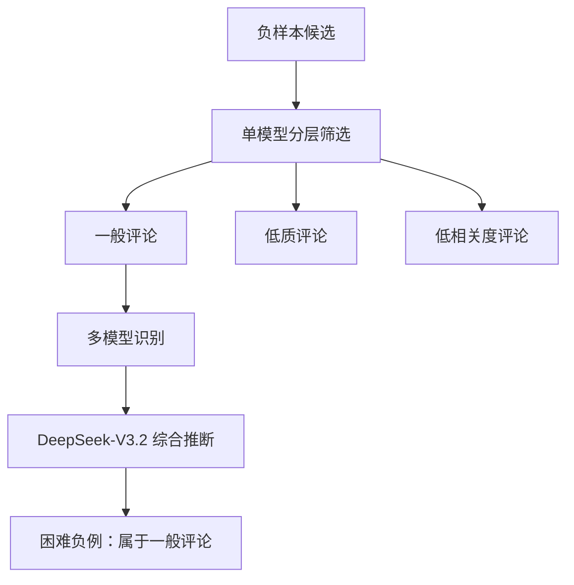
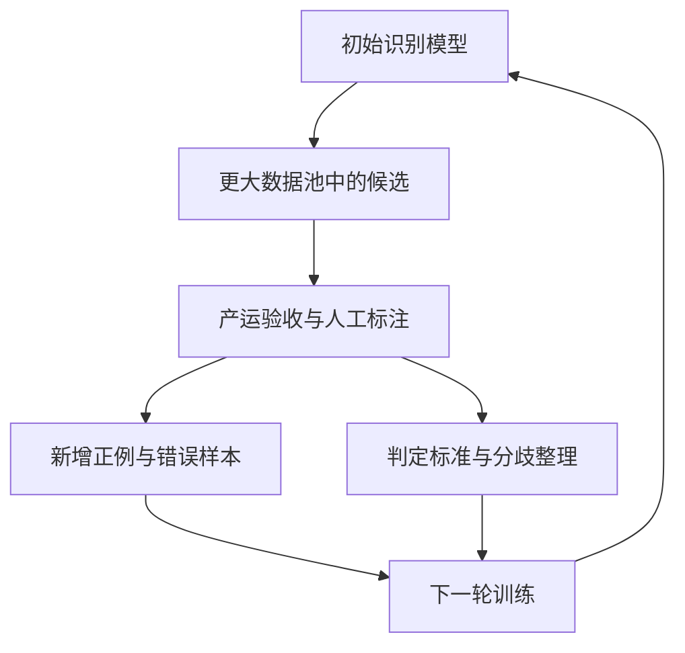

# 神评识别项目复盘：技术设计与业务推进

_字节实习项目复盘，围绕数据冷启动、模型训练、实验决策和分阶段业务验证展开。_

---

## 📋 项目定位与核心思考

项目面向站内神评识别，最终任务包含 **6 个神评类别和 1 个非神评类别**。神评在自然流量中的目标占比约为 **1%～3%**，业务强调高精准识别。项目早期缺少现成的数据基础，正样本稀缺，人工标注产能有限，需要同时解决数据获取、判定标准表达和交付节奏问题。

核心思考是：先识别有效正样本与标注产能的瓶颈，通过模型筛选与人工确认建立数据基础；在模型侧围绕判断依据、类别表示和样本分布设计训练方案；在业务侧提出二分类先行、候选结果先交付、数据持续回流的推进路径。

| 主线 | 关键工作或决策 | 体现的能力 |
| --- | --- | --- |
| 数据冷启动 | 多模型筛选候选，人工确认正样本，结合人工负例与弱标签负例扩充数据 | 瓶颈识别、标注资源分配 |
| 模型设计 | Qwen3-4B-Instruct、7 个类别 Special Token、结构化 Reasoning 监督 | 将业务标准转化为训练目标 |
| 负样本设计 | 负样本分层、多模型辅助的困难负例挖掘 | 类型覆盖与分类边界分析 |
| 实验决策 | Reasoning × Special Token 四组实验，四种正负比例实验 | 拆解变量、依据指标选择配置 |
| 业务推进 | 二分类先行，先验证候选可用性，再推进反馈回流和细分类完善 | 阶段拆解、交付意识、投入判断 |

本文中的数据规模、模型配置和实验结论来自项目复盘记录，未在本仓库重新运行。已完成工作包括数据构造、七分类训练设计、困难负例筛选和两组配置对比；二分类先行、产运验证及持续回流作为推进思路记录，具体上线状态、完整闭环运行情况和业务收益尚未提供。

## 📊 数据冷启动与标签质量分层

### 起点：自然流量中难以高效获取正样本

项目没有现成神评数据基础。早期使用多模型对比、投票，在约 **1 万～2 万条评论中筛出 100～300 条模型认为可能成立的神评候选**。这些结果属于候选伪标签，需要人工进一步确认，不能直接作为人工 Ground Truth（GT）。

这一阶段的瓶颈是有效样本的获取效率。有限的人力如果持续投入无差别标注，正样本积累与训练迭代都会受到约束。因此，先用模型缩小候选范围，再让人工确认，是将标注资源集中到稀缺样本上的办法。

这里的初始候选规模只是早期筛选观察，不能据此推导整套方案的候选召回率，也不能将多轮积累的数据全部归入同一批原始评论。

### 数据组成：人工 GT 与弱标签共同支持训练

经过多次迭代和人工辅助标注，逐步形成万量级数据。正样本全部经过人工标注；负样本中约 2,000 条经过人工标注，其余主要来自多模型一致认为非神评的弱标签数据。

按复盘提供的拆分口径，数量如下。弱标签负例数量和合计由已给出的数量相减、相加得到，不代表重新扫描数据文件的结果。

| 数据类型 | 训练集 | 测试集 | 合计 | 标签来源 |
| --- | ---: | ---: | ---: | --- |
| 神评正样本 | 1,000 | 417 | 1,417 | 全部人工标注 |
| 人工标注负样本 | 1,500 | 500 | 2,000 | 人工 GT |
| 弱标签负样本 | 6,500 | 5,500 | 12,000 | 多模型一致判负 |
| 负样本小计 | 8,000 | 6,000 | 14,000 | 人工 GT 与弱标签混合 |
| 数据总量 | 9,000 | 6,417 | 15,417 | 混合标签来源 |

其中，人工标注数据合计 3,417 条。训练集中的 `1:8` 指六类神评合并后与非神评之间的比例，不代表六个神评子类分别满足这一比例；各神评子类数量尚未提供。

### 技术合理性：按稀缺程度与标签可信度分配资源

正样本既稀缺，又直接承载神评判定标准，因此优先通过人工确认保障标签质量。负样本数量更大，采用人工 GT 与弱标签共同扩充的方式，使训练能尽早开始，同时保留一定的人工标注依据。

这种设计体现了对标注资源的分配：先保证稀缺正样本，再利用模型一致性扩大负样本覆盖。多模型一致判负仍可能共同漏掉神评，因此其含义是较一致的弱监督信号，不能替代人工 GT。

困难负例挖掘是另一条针对边界的筛选流程。其在上述负样本中的具体数量、人工复核覆盖率，以及与一致判负数据的归并方式尚未提供，不额外计入一份独立数据量。

## 🔧 技术亮点：判断依据与类别表示联合设计

### Qwen3-4B-Instruct：围绕任务需求选择基础模型

神评判定涉及评论含义、与上下文的关系，以及表达内核和独特性。选择指令模型的设计动机，是利用预训练语言理解能力承接这些判断，并在同一生成框架中表达识别理由与最终类别。

选择 4B 规模，可以从语义能力需求与后续批量挖掘、持续迭代的计算预算之间解释其权衡。当前未提供跨模型规模的对照、部署硬件、延迟或吞吐结果，因此不将“4B 成本效果最优”写成已验证结论，也不补充具体模型版本后缀。

### 7 个 Special Token：为七个互斥类别建立统一表示

为六类神评和非神评分别扩充一个独立 Special Token，使类别与 Token 一一对应。其明确的设计价值包括：

- **标签原子化：** 一个类别对应一个 Token，统一类别输出长度。
- **输出标准化：** 避免同一类别采用不同文字表述后再做归一化。
- **便于读取类别得分：** 可以在类别预测位置提取对应 Token 的 logits，为后续打分与决策提供接口。

在默认不拆分特殊 Token 的配置下，注册的特殊 Token 可以作为完整单元处理；注册本身不等于限制模型只能输出这七个类别。严格限制输出需要额外的解码约束，当前没有提供是否使用此类约束的实现信息。[^1]

在生成式训练中，类别 Token 可以沿用语言模型的 next-token prediction 目标，不应直接描述成“新增了一个七分类头”。新增 Token 的业务含义仍需要学习，不能仅凭扩词表就断言消除了类别混淆。

扩词表实现需要对齐 tokenizer、输入嵌入和输出词表相关参数，并检查训练、保存及加载是否完整。如果使用 LoRA，需要额外确认新增 Token 相关参数的可训练性和保存方式；这是实现核验要点，本文没有确认项目采用了哪一种微调配置。[^2]

### 结构化 Reasoning：把隐含标准写进监督内容

项目设计了 **“内核分析—稀缺性分析—结论”** 的识别理由结构，并将 Reasoning 作为监督信号进行实验。

| 阶段 | 判断内容 | 与任务的关系 |
| --- | --- | --- |
| 内核分析 | 评论表达了什么，是否有有效内容，如何与上下文关联 | 判断内容本身是否成立 |
| 稀缺性分析 | 是否具有区别于普通评论的独特性，是否只是常见表达 | 区分普通评论与达到神评标准的评论 |
| 结论 | 综合上述依据，输出业务类别 | 将判断依据落实为分类结果 |

仅有类别标签时，模型获得的是最终答案；加入结构化理由监督，希望进一步提供判断维度和依据。已有研究探索了使用理由作为额外监督训练较小模型的方向，但该研究只支持设计动机，项目中的具体收益仍以自己的对照实验为准。[^3]

“稀缺性”在这里应有明确的操作定义。如果输入没有评论池、检索结果或频次证据，更准确的含义是表达独特性或相对普通评论的非模板化程度，不能称为对站内实际出现频率的精确估计。

正样本标签经过人工确认，也不代表理由文本全部经过人工核验。理由的生成来源、筛选规则，以及与原始评论和类别的一致性，需要与标签质量分别记录。理由可以作为审核和错误分析的载体，但不能仅凭理由看起来合理，就认定它忠实反映了模型的决策机制。

### 两种设计的组合逻辑

Reasoning 监督作用于“依据什么判断”，Special Token 作用于“如何表示最终判断”。两者分别对应监督内容与输出表示，具有组合验证的价值。

项目已经通过四组实验观察到二者结合表现最好。这支持采用组合方案；是否每个模块在所有条件下都独立有效、是否存在额外协同增益，需要进一步看各组具体差值。

如果实际实现采用“先理由、后类别”的单序列训练，评测时应让模型自行生成理由，再预测类别，避免将标准理由输入模型后得到不符合实际推理条件的结果。理由较长而类别只有一个 Token 时，也应关注类别位置的监督贡献。输出顺序、loss mask 和类别 loss 是否单独加权尚未确认，不把这些实现细节写成既成事实。

## 🔍 技术亮点：样本分布与困难负例挖掘

### 1:8：通过实验确定正负样本权衡

项目比较了 `1:5、1:8、1:10、1:12` 四种正负采样比例，最终观察到 **1:8 的 Precision 与 Recall 权衡最好**，因此采用该配置。

自然流量正样本占比约为 1%～3%，而 `1:8` 对应训练中约 11.1% 的正样本占比。这属于相对自然分布提高正样本比例：让稀缺正样本更充分地参与学习，同时保留负样本的数量与覆盖。

技术动机是兼顾正类特征学习与负类边界建立。最终比例由已测配置的准召表现支持，不需要将其解释成天然最优，也不能断言负样本越多就必然越精准。

由于业务强调高精准，进一步比较时可以在满足业务 Precision 要求的前提下观察 Recall。但当前只确认了准召权衡结论，没有确认是否使用固定 Precision 的对比方式，也没有提供各比例的具体 P/R 或单调变化趋势。

### 2:1:1：单模型完成负样本类型分层

一般评论、低质评论和低相关度评论由单模型筛选，并按约 **2:1:1** 构造负样本。这个比例基于任务理解设置，没有进行独立的比例最优性验证。

| 类型 | 采样占比 | 希望覆盖的判定要求 |
| --- | ---: | --- |
| 一般评论 | 约 50% | 区分正常、相关、表达成立的评论与神评 |
| 低质评论 | 约 25% | 建立内容质量门槛 |
| 低相关度评论 | 约 25% | 学习评论与上下文的匹配要求 |

一般评论保留较高占比的设计考虑，是其中可能包含质量尚可但没有达到神评标准的样本，需要更细致的判断。这是对任务边界的分析，不能在缺少误差统计时直接认定一般评论已经被证明是最大的误报来源。

分层方法也需要明确类别归属规则：同一评论可能同时低质且低相关，去重或归类优先级应以实际筛选实现为准，当前未提供该细节。

### 多模型识别与 DeepSeek-V3.2 综合推断

在一般评论中，进一步调用多个模型进行识别，再将多模型识别结果交给主模型 **DeepSeek-V3.2** 综合推断，筛选困难负例。

这里的多模型流程与初始正样本候选投票承担不同职责。困难负例筛选应描述为“多模型辅助、主模型综合判定”，不直接简化为多数投票。

| 环节 | 输入与输出职责 | 技术作用 |
| --- | --- | --- |
| 单模型分层 | 从候选中筛选三类负样本 | 建立类型覆盖 |
| 多模型识别 | 为一般评论提供多份识别结果 | 提供额外判定信息 |
| 主模型综合推断 | 结合多模型结果筛选困难负例 | 在统一判定环节处理多份信息 |
| 训练数据补充 | 将筛选结果纳入一般评论层 | 补充需要细辨的负类样本 |

困难负例是一般评论中的一个子集，不是 `2:1:1` 之外新增的第四种采样类别。其具体占比目前没有给出。

这种方法把“负样本类型覆盖”和“负样本判别难度”分开处理，并将额外的多模型计算集中于一般评论。它体现了分阶段分配计算资源的思路；没有调用成本记录时，不声称已经量化降低成本。

多模型结果是否包含理由、主模型具体依据何种标准判断困难程度，以及筛选结果是否全部经过人工确认尚未提供。不能自行补充为“按分歧阈值筛选”“取最高正类分数”或“全部人工复核”。缺少难度排序证据时，使用“困难负例”比“最难负例”更准确。

### 与 Reasoning 监督围绕同一判定边界设计

困难负例的目标，是让模型接触具有部分神评特征、但仍未达到业务标准的评论。内核分析关注内容是否成立，稀缺性分析关注表达是否超出普通评论，困难负例为这些维度提供反面样本。

例如，“表达流畅且相关，但观点常见”可以说明这一类边界；此例仅用于解释设计，不代表已经确认项目中某条具体样本的内容。

三项设计由此形成联系：结构化理由表达判断依据，困难负例补充边界案例，类别 Token 统一最终结论。它们围绕同一套业务标准组织，但困难负例的独立指标收益仍需要加入前后的对照实验支持。

## 📈 实验工作与结论边界

### Reasoning 与 Special Token 的 2×2 对照

| 实验 | Reasoning 监督 | Special Token | 比较目的 |
| --- | --- | --- | --- |
| A | 无 | 无 | 建立基线 |
| B | 有 | 无 | 观察理由监督的作用 |
| C | 无 | 有 | 观察类别表示的作用 |
| D | 有 | 有 | 验证二者组合 |

已确认的实验结论：**D 组指标更好，训练更加稳定**。当前没有提供四组逐项数值和稳定性的具体定义，因此保留定性结论，不补写提升百分点、方差或收敛轮数。

这组实验体现了主动拆解因素的能力。比较 B 与 A、C 与 A，可以观察单项设计相对于基线的表现；比较 D 与 B、D 与 C，可以观察在另一项设计已经存在时的增量表现。组合最好不自动证明两个因素具有额外协同增益。

为了让比较可解释，实验记录应说明基础模型、数据切分、训练预算、优化设置和评测方式如何保持可比。当前没有完整配置日志，不能据此宣称所有条件已经严格控制。

### 正负样本比例对比

| 正负比例 | 是否实验 | 已确认结论 |
| --- | --- | --- |
| 1:5 | 是 | 作为比较配置，具体指标未提供 |
| 1:8 | 是 | 准召权衡最好，最终采用 |
| 1:10 | 是 | 作为比较配置，具体指标未提供 |
| 1:12 | 是 | 作为比较配置，具体指标未提供 |

改变负样本数量也可能改变训练数据总量与计算预算，因此需要说明正样本集合、负样本来源、训练步数及采样方式，才能区分比例变化和额外数据带来的作用。

以上是两组实验工作。没有确认所有模型监督配置与所有采样比例做过交叉组合，因此不称为完整联合网格搜索。

### “训练更稳定”的可核验表述

后续应从实际记录中确定稳定性指什么，再采用对应表述。

| 实际证据 | 可采用的说法 |
| --- | --- |
| 不同 checkpoint 的验证指标波动较小 | 验证指标在训练过程中更稳定 |
| 多个随机种子下结果差异较小 | 多次训练结果方差更小 |
| 无效类别输出更少 | 类别输出格式更稳定 |
| 后期验证效果退化更少 | 后期训练性能退化较少 |
| 仅观察到 loss 曲线波动较小 | 训练损失曲线更平稳 |

有无 Reasoning 时，输出长度与监督 Token 构成不同，不能仅凭总 loss 更低就证明分类能力更好。没有多随机种子实验，就不将一次运行观察扩展为重复训练结论。

### Benchmark 与评测口径

复盘报告的 Benchmark 为 **Precision 91%、Recall 88%**。这组数值作为已有结果保留；对应数据版本、阈值和类别聚合方式尚未明确，不能将其自动视为线上自然流量表现。

七分类需要区分两个评测层面：

- **神评识别：** 将六类神评合并为正类，非神评为负类，报告二分类 P/R。真实神评子类之间的混淆在该口径下仍属于检出成功。
- **神评细分：** 报告七分类的逐类指标、Macro-F1 和混淆矩阵，观察不同子类之间的识别能力。

如果使用七个互斥类别的概率构造神评分数，可以汇总六个神评类别的概率，再在验证集选择阈值；概率归一化不等于已经校准。当前未确认项目是否采用这一评分方式，也未确认 P 91%、R 88% 是否来自合并后的二分类统计。

按提供的测试集规模，正样本占比为 `417 / 6,417 ≈ 6.5%`，高于自然流量中的 1%～3%。Precision 会随正样本占比及样本难度分布变化，因此测试集数值不能直接替代线上 Precision。

该测试集还包含约 5,500 条弱标签负例。人工核验部分与混合测试集应分别说明；若人工核验样本也是从模型候选中选出，它们同样未必代表自然流量。模型判负池中的漏检需要抽检才能被发现。

### 后续实验与证据补充优先级

以下是待补充的验证工作，不计入已完成实验。

| 验证问题 | 建议方式 | 目的 |
| --- | --- | --- |
| 高精准目标下的实际检出能力 | 验证集选择阈值，固定后在人工核验测试集评估 | 避免用测试集反复调阈值 |
| 困难负例的独立贡献 | 等量新增随机负例与困难负例进行对照 | 区分样本数量和样本难度的作用 |
| 2:1:1 的合理范围 | 同规模负样本下比较分层配比 | 验证经验比例是否需要调整 |
| 稀缺性分析的贡献 | 仅内核分析与完整结构比较 | 观察普通评论误报变化 |
| 训练稳定性 | 汇总 checkpoint 或多次训练指标 | 将定性观察转成可核验证据 |
| 业务分布上的泛化 | 人工核验自然流量，并隔离重复或高度关联样本 | 检查分布差异和数据泄漏 |

## 🔄 业务流程亮点：分阶段交付与数据回流

### 识别瓶颈，让基础能力尽早承担实际用途

项目推进思路是：在人工标注资源有限时，先形成可用的二分类能力，用于外展神评候选，供产运观察效果和判断初步价值；与此同时，让模型帮助算法侧获得更多值得标注的数据，再逐步完善七分类能力。

“先做 0.2、0.3 的版本”可以表达为：将任务拆成基础识别、候选验收、数据回流和细分类完善几个阶段，每一阶段都有明确交付物，并为下一阶段提供数据或能力。

这是一项推进策略，不代表已经确认线上采用两级模型架构，也不意味着已完成七分类训练在时间上一定发生于某次二分类上线之后。

### 分阶段交付物与验收问题

| 阶段 | 计划交付 | 需要回答的问题 |
| --- | --- | --- |
| 基础识别 | 初始二分类模型与神评候选 | 能否找到符合基本标准的内容？ |
| 小范围业务验证 | 供产运审核的候选结果及判断依据 | 业务是否认可，可用内容是否足够？ |
| 模型辅助标注 | 新增正例、误报、分歧与边界样本 | 哪些样本值得优先投入人工？ |
| 持续迭代 | 回流数据与更新后的模型 | 主要错误是否减少，覆盖是否改善？ |
| 细分类完善 | 六类神评与非神评的完整识别能力 | 不同神评类型是否可区分并支持业务使用？ |

先交付候选结果，可以让产运较早参与判定标准对齐，也让算法侧尽早获得真实审核反馈。它体现的是对交付节奏与资源约束的处理，不直接等同于已经获得用户消费或互动收益。

### 规划中的数据迭代闭环

下面展示计划中的回流机制，尚未确认全部环节均已运行。

为了使模型辅助标注有明确用途，可以规划以下样本入口：

| 样本入口 | 审核后的用途 |
| --- | --- |
| 模型预测的神评候选 | 获取新增正样本，识别误报 |
| 多模型分歧或边界附近的样本 | 澄清判定标准，补充边界案例 |
| 模型误报的非神评 | 构建困难负例，针对具体错误训练 |
| 判负池中的随机抽检样本 | 发现漏掉的神评，减少对现有模型偏好的依赖 |

分歧采样、边界采样和随机抽检是闭环完善建议，不能与已经实施的“多模型结果交给 DeepSeek-V3.2 综合筛选”混为同一个已确认算法。

### 让结构化理由成为跨团队沟通载体

“内核分析—稀缺性分析—结论”除了用于训练，也可以帮助人工审核定位分歧：是对评论内容理解不同，还是对表达独特性和神评门槛的标准不同。

业务反馈可以进一步沉淀为标注标准与边界案例，形成从审核意见到训练数据的转化路径。理由必须能对应实际评论，不能用流畅的解释替代标签审核。

这一流程希望逐步将人工工作从无差别标注转向候选确认、分歧裁决和错误修正。标注耗时是否减少、正样本获取效率是否提高，需要后续记录支持。

### 区分模型效果、业务可用性与真实收益

| 层面 | 适合观察的内容 | 当前状态 |
| --- | --- | --- |
| 模型识别效果 | P/R、各类表现、稳定性 | 已有部分实验结论与 Benchmark |
| 业务可用性 | 候选通过率、可用候选量、人工审核耗时 | 尚未提供实际验收数据 |
| 业务收益 | 投放后消费、互动或其他目标指标 | 尚未提供线上实验结果 |

因此，业务表达应以“尽早提供可审核的候选，验证可用性与继续投入的价值”为主。只有实际业务实验提供证据后，再加入具体收益数字。

## ✍️ 面试表达与简历写法

### 技术亮点表达

这个项目包含六类神评和一个非神评类别，主要难点是正样本稀缺、判定标准需要结合内容理解，而且业务要求高精准。我从监督内容、类别表示和样本分布三个方面设计方案。

模型侧，基于 Qwen3-4B-Instruct 为七个类别分别扩充独立 Special Token，并设计“内核分析—稀缺性分析—结论”的结构化理由监督。为了验证两个设计，我做了有无 Reasoning、有无 Special Token 的四组对照，最终二者结合的方案指标最好，训练也更稳定；稳定性的具体表现需要结合训练记录展开。

数据侧，我比较了 1:5、1:8、1:10、1:12 四种正负比例，选择准召权衡最合适的 1:8。负样本先由单模型分为一般评论、低质评论和低相关度评论，按约 2:1:1 构造；再对一般评论做多模型识别，交给 DeepSeek-V3.2 综合推断，筛选困难负例。内部配比是基于任务理解设置的，困难负例用于针对性补充判定边界，尚未单独量化其指标收益。

### 业务流程亮点表达

项目早期没有现成的神评数据基础，在一两万条数据中通过多模型筛选，也只能得到一两百条量级的疑似正样本，人工标注产能有限。我首先判断，需要同时解决有效样本获取和交付节奏问题。

数据上，我通过模型筛选与人工确认结合积累样本，所有正样本都经过人工标注，负样本结合人工 GT 与多模型一致判负的弱标签。推进上，我提出先建立二分类能力，给产运提供可审核的神评候选，尽早判断结果是否符合业务预期。

同时，我规划让初始模型参与后续数据建设，从更大的数据池中发现候选，把值得确认的样本和错误优先交给人工，再回流训练。这样，每个阶段既有明确交付物，也能为后续模型积累数据。实际闭环运行轮次、验收指标和业务收益，需要按已经发生的结果补充。

### 简历条目参考

- **模型训练与实验：** 基于 Qwen3-4B-Instruct 构建神评七分类模型，为六类神评及非神评扩充 7 个类别 Special Token，设计“内核分析—稀缺性分析—结论”结构化理由监督；完成 Reasoning 与 Special Token 的 2×2 对照实验，组合方案取得四组配置中的最佳指标。
- **数据构造与难负挖掘：** 结合多模型筛选与人工标注构建万量级数据；对比四种正负比例，选择准召权衡最佳的 1:8；按一般评论、低质评论、低相关度评论约 2:1:1 分层构造负例，结合多模型识别结果与 DeepSeek-V3.2 综合推断挖掘困难负例。
- **评测结果：** Benchmark Precision 91%、Recall 88%。正式使用时补齐对应数据版本、类别聚合方式与阈值口径。

如果需要展示业务推进思考，可以补充“提出二分类先行、候选验收与数据回流的分阶段推进方案”。只有确认流程已经落地后，才改为“建立业务反馈闭环”并补充实际结果。

### 面试前需要补齐的事实

| 待补信息 | 为什么值得准备 |
| --- | --- |
| 六类神评的名称、定义与代表样本 | 解释七分类标准及边界 |
| 模型具体版本、训练方式、Token 参数更新与输出顺序 | 说明训练实现是否与设计一致 |
| Reasoning 的来源、校验方式和 loss 设置 | 解释理由监督的质量与作用位置 |
| 四组实验和四种采样比例的具体指标及训练预算 | 支持配置选择与因素分析 |
| 训练稳定性的具体证据 | 避免将观察扩展为未做过的实验 |
| 困难负例的筛选标准、数量与人工复核情况 | 说明难度定义及标签可信度 |
| Benchmark 的聚合方式、数据版本和阈值 | 准确解释 P 91%、R 88% |
| 二分类交付、产运验收与回流的实际完成状态 | 区分推进方案与已实现业务价值 |

## 🔗 技术参考

以下资料仅用于解释通用机制，不作为本项目实验结果、训练配置或业务落地状态的证明。

[^1]: Hugging Face， [Tokenizer 官方文档](https://huggingface.co/docs/transformers/main/main_classes/tokenizer)：特殊 Token 的注册、拆分与解码行为。
[^2]: Hugging Face， [PEFT Troubleshooting](https://huggingface.co/docs/peft/developer_guides/troubleshooting)：扩展词表及训练新增 Token 相关参数的处理。
[^3]: Hsieh et al.，2023， [Distilling Step-by-Step! Outperforming Larger Language Models with Less Training Data and Smaller Model Sizes](https://aclanthology.org/2023.findings-acl.507/)：将理由作为额外监督训练较小模型的研究。
